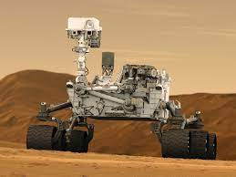

<html lang="en">
<head>
  <meta charset="UTF-8">
  <meta name="viewport" content="width=device-width, initial-scale=1.0">
  <title>Robótica na Astronomia</title>
  
</head>
<body>
  

    <h1>Robótica na Astronomia</h1>
    
A robótica desempenha um papel crucial na exploração espacial e na astronomia. Robôs espaciais, como os rovers em Marte, são projetados para coletar dados, realizar experimentos e explorar terrenos desafiadores em planetas distantes.

    
    
Esses robôs são equipados com uma variedade de sensores, câmeras e instrumentos científicos que os ajudam a estudar a composição do solo, a geologia, a atmosfera e até mesmo a busca por sinais da vida extraterrestre.

    

      <iframe width="560" height="315" src="https://www.youtube.com/watch?v=qZvRhxvlqU4" frameborder= "0" allowfullscreen></iframe>
    

    
A robótica na astronomia permite que os cientistas realizem descobertas incríveis e expandam nosso entendimento do universo

    
Para mais informações, consulte o <a href="https://www.nasa.gov/">NASA</a>.

  

</body>
</html>
